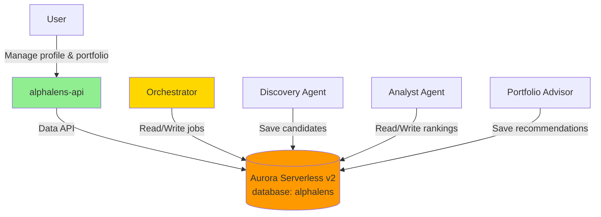
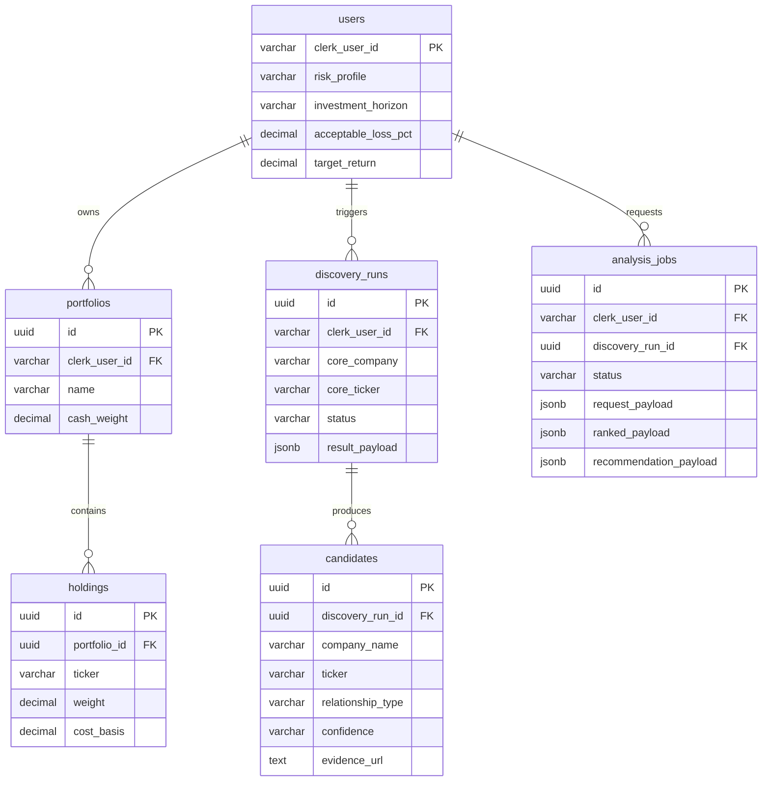

# AlphaLens — Guide 2: Database & Shared Infrastructure

Welcome to Guide 2! You'll deploy Aurora Serverless v2 PostgreSQL with the **Data API** and set up the shared database library that AlphaLens agents and the API will use.

## Why Aurora Serverless v2 with Data API?

AlphaLens uses the same database strategy as Alex:

| Benefit | Why it matters for AlphaLens |
|---------|------------------------------|
| **No VPC complexity** | Lambda and agents call the database over HTTP via the Data API |
| **PostgreSQL + JSONB** | Structured tables for users, portfolios, discovery runs, and job results |
| **Serverless scaling** | Scales with demand; configurable min/max ACUs |
| **Pay-per-use** | Good for development; destroy when not in use |

Other AWS options (DynamoDB, regular RDS, Neptune) are a poor fit for relational portfolio and job data — see [../../guides/5_database.md](../../guides/5_database.md) for the full comparison.

## What We're Building

In this guide you'll deploy:

- Aurora Serverless v2 PostgreSQL cluster (`alphalens-aurora-cluster`) with Data API enabled
- Credentials in Secrets Manager (`alphalens-aurora-credentials-*`)
- Security group and subnet group (default VPC)
- IAM role for Lambda Data API access (`alphalens-lambda-aurora-role`)
- Shared Python package at `alphalens/backend/database/`

**Coexistence with Alex:** All resource names use the `alphalens-` prefix, so this cluster can run in the **same AWS account** as Alex's `alex-aurora-cluster` without naming conflicts.



## Prerequisites

Before starting:

- [Guide 1 — Permissions](./1_permissions.md) (Alex IAM + RDS policies if not already done)
- AWS CLI configured as your `aiengineer` IAM user
- Terraform installed
- `uv` installed for Python

If you completed Alex Guide 5, you already have RDS permissions and can skip the IAM section below.

## Step 0: IAM Permissions (if needed)

AlphaLens needs the same RDS, EC2 (VPC/subnets), Secrets Manager, and Data API permissions as Alex Guide 5.

**Fast path:** If you're in the `AlexAccess` group and completed [../../guides/5_database.md](../../guides/5_database.md) Step 0, you're done.

**Otherwise**, follow **Step 0** in [../../guides/5_database.md](../../guides/5_database.md) to create `AlexRDSCustomPolicy` and attach:

- `AmazonRDSDataFullAccess`
- `SecretsManagerReadWrite`
- `AlexRDSCustomPolicy`

Verify:

```bash
aws rds describe-db-clusters
aws rds-data execute-statement --help
# Should list required args: --resource-arn, --secret-arn, --sql
```

## Step 1: Configure Terraform

```bash
# From the alex repo root
cd alphalens/terraform/1_database

cp terraform.tfvars.example terraform.tfvars
```

Edit `terraform.tfvars`:

```hcl
aws_region = "us-east-1"   # Your default region

# Aurora Serverless v2 scaling (0.5 ACU ≈ $43/month minimum)
min_capacity = 0.5
max_capacity = 1.0

# Optional overrides (defaults are fine for MVP)
# database_name           = "alphalens"
# master_username         = "alphalensadmin"
# engine_version          = "15.12"
# backup_retention_period = 7
```

## Step 2: Deploy Aurora

```bash
terraform init
terraform plan
terraform apply
```

Type `yes` when prompted. Deployment takes **10–15 minutes**.

Terraform creates:

| Resource | Name |
|----------|------|
| Aurora cluster | `alphalens-aurora-cluster` |
| Database | `alphalens` |
| Master user | `alphalensadmin` |
| Secret | `alphalens-aurora-credentials-<suffix>` |
| Lambda IAM role | `alphalens-lambda-aurora-role` |

View outputs:

```bash
terraform output
terraform output setup_instructions
```

## Step 3: Update Environment Variables

Copy values from Terraform output into **`alphalens/.env`** (not the parent Alex `.env` unless you prefer one file):

```bash
# AlphaLens Database (Guide 2)
AURORA_CLUSTER_ARN=arn:aws:rds:us-east-1:123456789012:cluster:alphalens-aurora-cluster
AURORA_SECRET_ARN=arn:aws:secretsmanager:us-east-1:123456789012:secret:alphalens-aurora-credentials-xxxxx
DATABASE_NAME=alphalens
DEFAULT_AWS_REGION=us-east-1
```

## Step 4: Wait for Cluster Availability

Wait until cluster status is `available`:

```bash
aws rds describe-db-clusters \
  --db-cluster-identifier alphalens-aurora-cluster \
  --query 'DBClusters[0].Status' \
  --output text
```

Test with the AWS CLI (replace ARNs from your `terraform output`):

```bash
aws rds-data execute-statement \
  --resource-arn "$AURORA_CLUSTER_ARN" \
  --secret-arn "$AURORA_SECRET_ARN" \
  --database alphalens \
  --region us-east-1 \
  --sql "SELECT version()"
```

Confirm Data API is enabled (note: API field is `HttpEndpointEnabled`, not `EnableHttpEndpoint`):

```bash
aws rds describe-db-clusters \
  --db-cluster-identifier alphalens-aurora-cluster \
  --region us-east-1 \
  --query 'DBClusters[0].HttpEndpointEnabled' \
  --output text
```

Should return `True`. If you query `EnableHttpEndpoint` you will get `None` — that field name does not exist on the response.

## Step 5: Test Connection

```bash
cd alphalens/backend/database
uv sync
uv run test_data_api.py
```

You should see `✅ Data API is working!`

## Step 6: Initialize the Database Schema

```bash
cd alphalens/backend/database
uv run run_migrations.py
```

## Step 7: Load Demo Data (Optional)

Creates a test user, demo portfolio (NVDA/AAPL/TSLA/CASH), and NVIDIA discovery run from curated JSON:

```bash
uv run reset_db.py --with-test-data
```

Or reset from scratch (drop → migrate → test data):

```bash
uv run reset_db.py --with-test-data
```

Verify:

```bash
uv run verify_database.py
```

Expected tables:

| Table | Purpose |
|-------|---------|
| `users` | Clerk user ID, risk profile, investment horizon |
| `portfolios` | User portfolio containers |
| `holdings` | Ticker + weight per portfolio |
| `discovery_runs` | Ecosystem discovery jobs (written by Guide 4 Step 7 — discover API, live discovery, orchestrator) |
| `candidates` | Companies/tickers from a discovery run |
| `analysis_jobs` | Full analyze pipeline status; `ranked_payload` (includes `analysisReport`), `recommendation_payload`, `discovery_run_id` |

See [../design-doc.md](../design-doc.md) for product context.

## Planned Schema (ER diagram)



## Terraform Outputs Reference

| Output | Use |
|--------|-----|
| `aurora_cluster_arn` | `AURORA_CLUSTER_ARN` in `.env` |
| `aurora_secret_arn` | `AURORA_SECRET_ARN` in `.env` |
| `database_name` | `DATABASE_NAME` in `.env` |
| `lambda_role_arn` | Agent Lambda IAM in Guide 3 (`terraform/2_agents`) |
| `aurora_cluster_endpoint` | Debugging only (Data API preferred) |
| `setup_instructions` | Copy-paste post-deploy steps |

## Cost Management

Approximate costs at `min_capacity = 0.5`:

- **~$43/month** minimum while cluster exists
- **~$1.44–2.88/day** depending on usage

When not developing:

```bash
cd alphalens/terraform/1_database
terraform destroy
```

⚠️ **Warning:** This deletes the cluster and all data. Recreate later with `terraform apply`.

**Recommendation:** Complete Guides 2–4, then destroy if taking a break from the project.

## Troubleshooting

### Cluster still creating

Aurora can take 10–15 minutes on first deploy. Check status:

```bash
aws rds describe-db-clusters --db-cluster-identifier alphalens-aurora-cluster
```

### Data API connection fails

1. Cluster status must be `available`
2. `HttpEndpointEnabled` must be `true` (see Step 4)
3. ARNs in `.env` must match `terraform output` exactly
4. Region in CLI commands must match `aws_region` in `terraform.tfvars`

### Secret not found

Secret name includes a random suffix:

```bash
aws secretsmanager list-secrets \
  --query "SecretList[?contains(Name, 'alphalens-aurora-credentials')].Name"
```

### Name conflict with Alex

If apply fails with "already exists", you may have an old partial deploy. Either:

- Import the existing resource, or
- `terraform destroy` in this directory and re-apply

AlphaLens and Alex use **different** cluster identifiers (`alphalens-*` vs `alex-*`).

### Terraform validate locally

```bash
cd alphalens/terraform/1_database
terraform init
terraform validate
```

## Next Steps

You should now have:

- ✅ Aurora Serverless v2 with Data API
- ✅ Secrets Manager credentials
- ✅ Lambda IAM role for database access
- ✅ `.env` configured for `alphalens/backend/database`

Continue to [3_agents.md](./3_agents.md) to deploy the agent orchestra (Lambdas + SQS) that reads and writes this database.
