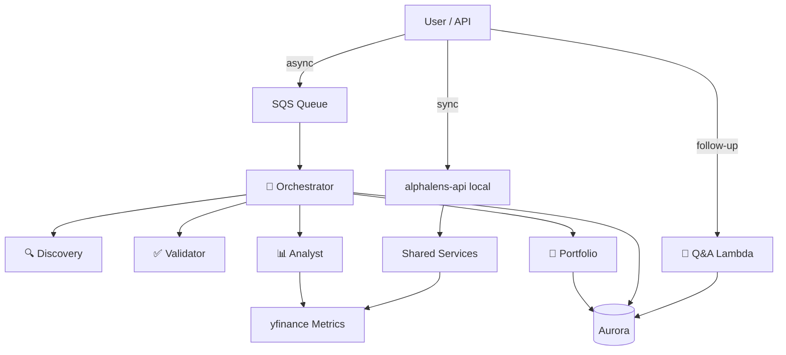

# AlphaLens — Agent Orchestra (Guide 3)

Welcome to the agent orchestra! In this guide you'll deploy a multi-agent pipeline that discovers ecosystem candidates, validates tickers, ranks opportunities with real market metrics, and produces portfolio-aware recommendations.

## REMINDER — Get help from an AI assistant

There's a file `AGENTS.md` in `alphalens/` (and `CLAUDE.md`) that describes the full project. If you need help:

> I am building AlphaLens in the alex repo under `alphalens/`. Read `alphalens/AGENTS.md` and `alphalens/guides/3_agents.md` completely. I'm on Guide 3 (agents). Help me with [your issue].

Always ask for root cause and evidence before applying fixes.

## What You're Building

Six Lambda functions — five coordinated by SQS for analysis jobs, plus Q&A for follow-up questions:

1. **Orchestrator** — SQS-triggered workflow; loads `analysis_jobs` from Aurora
2. **Discovery** — Ecosystem candidate discovery (curated NVIDIA demo; live research in Guide 4)
3. **Validator** — Ticker format and symbol validation
4. **Analyst** — yfinance metrics + opportunity ranking (deterministic, not LLM)
5. **Portfolio** — Portfolio risk analysis + action recommendations
6. **Q&A** — Answers about a completed job; deployed as `alphalens-qa` Lambda




## Why This Architecture?

1. **Separation of concerns** — Each step can be tested and deployed independently
2. **Shared logic** — `alphalens_shared/services/` is used by both API and Lambdas
3. **Deterministic metrics** — Numbers come from code, not hallucinated by an LLM
4. **Async + sync** — API can run the pipeline inline, or enqueue SQS for long jobs
5. **Guide 4 ready** — Discovery swaps curated JSON for Bedrock + Playwright MCP

## Prerequisites

Before starting, ensure you have:

- Completed **Guide 1** (IAM permissions) and **Guide 2** (Aurora + migrations)
- AWS CLI configured as `aiengineer`
- Python with `uv` installed
- **Docker Desktop running** (for Lambda packaging)
- Optional: Bedrock Nova Pro access in `us-west-2` (for Guide 4; not required for MVP agents)

## Step 0: Request Bedrock Model Access (optional now, required for Guide 4)

MVP agents (validator, analyst, portfolio) do **not** call Bedrock yet. Still worth enabling now:

1. AWS Console → **Amazon Bedrock**
2. Region: **US West (Oregon) us-west-2**
3. **Model access** → **Manage model access**
4. Enable **Amazon Nova Pro** → **Request model access**

## Step 1: Configure Environment

Open `alphalens/.env` and confirm database values from Guide 2:

```bash
DEFAULT_AWS_REGION=us-east-1
AURORA_CLUSTER_ARN=arn:aws:rds:...
AURORA_SECRET_ARN=arn:aws:secretsmanager:...
DATABASE_NAME=alphalens

BEDROCK_MODEL_ID=us.amazon.nova-pro-v1:0
BEDROCK_REGION=us-west-2

# Local testing — invoke services in-process instead of Lambda
MOCK_LAMBDAS=true
```

After Terraform deploy (Step 6), you'll add:

```bash
SQS_QUEUE_URL=https://sqs.us-east-1.amazonaws.com/.../alphalens-analysis-jobs
ORCHESTRATOR_FUNCTION=alphalens-orchestrator
DISCOVERY_FUNCTION=alphalens-discovery
VALIDATOR_FUNCTION=alphalens-validator
ANALYST_FUNCTION=alphalens-analyst
PORTFOLIO_FUNCTION=alphalens-portfolio
QA_FUNCTION=alphalens-qa
```

After Guide 4 live discovery deploy, also add `DISCOVERY_SERVICE_URL` (see [4_discovery.md](./4_discovery.md) Step 6.3) and optional `discovery_service_url` in `terraform/2_agents/terraform.tfvars`.

## Step 2: Explore the Agent Code

Each agent follows the **Alex three-file pattern**. Start with `agent.py` — it is the primary entry point for both MVP (`run()`) and LLM mode (`create_agent()`).

Shared business logic lives in `alphalens_shared/services/` so the **API** and **Lambdas** call the same code.

### 2.1 Discovery (`backend/discovery`)


| File                | What to read                                                       |
| ------------------- | ------------------------------------------------------------------ |
| `agent.py`          | `run()` → curated path; `create_agent()` → Bedrock + MCP (Guide 4) |
| `templates.py`      | `DISCOVERY_INSTRUCTIONS`, `create_discovery_task()`                |
| `lambda_handler.py` | Calls `run(payload)`                                               |


Service: `backend/shared/alphalens_shared/services/discovery.py` loads `curated_nvidia_ecosystem.json`.

### 2.2 Validator (`backend/validator`)


| File                | What to read                                           |
| ------------------- | ------------------------------------------------------ |
| `agent.py`          | `run()` only — `create_agent()` raises (deterministic) |
| `templates.py`      | Reserved for future prompts                            |
| `lambda_handler.py` | Calls `run(payload)`                                   |


Service: `backend/shared/alphalens_shared/services/validator.py` — ticker regex, known-symbol checks.

### 2.3 Analyst (`backend/analyst`)


| File                | What to read                                           |
| ------------------- | ------------------------------------------------------ |
| `agent.py`          | `run()` only — `create_agent()` raises (deterministic) |
| `lambda_handler.py` | Calls `run(payload)`                                   |


Services: `services/analyst.py` + `backend/metrics/alphalens_metrics/`:

- **MarketMetricEngine** — valuation, momentum, volatility via yfinance
- **OpportunityRankingService** — scores and ranks candidates
- **MarketRegimeService** — SPY/QQQ regime (Favorable / Neutral / Risk-off)

### 2.4 Portfolio (`backend/portfolio`)


| File                | What to read                                                    |
| ------------------- | --------------------------------------------------------------- |
| `agent.py`          | `run()` for MVP; `create_agent()` for structured Bedrock output |
| `templates.py`      | `PORTFOLIO_INSTRUCTIONS`, `create_portfolio_task()`             |
| `lambda_handler.py` | Calls `run(payload)`                                            |


Service: `services/portfolio.py` — **PortfolioRiskEngine**, **ActionPlanService**; output matches design-doc §14.

### 2.5 Orchestrator (`backend/orchestrator`)


| File                | What to read                                                          |
| ------------------- | --------------------------------------------------------------------- |
| `agent.py`          | `run()` for fixed pipeline; `create_agent()` with Lambda invoke tools |
| `templates.py`      | Orchestrator instructions + task builder                              |
| `lambda_handler.py` | SQS handler → `pipeline_job.py`                                       |


Services:

- `services/pipeline.py` — discovery → validation → ranking → portfolio
- `lambda_invoke.py` — real Lambdas or in-process mocks via `MOCK_LAMBDAS`
- `json_utils.py` — strips NaN/Inf before Lambda JSON (required for yfinance data)

### 2.6 Q&A (`backend/qa`)


| File                | What to read                                              |
| ------------------- | --------------------------------------------------------- |
| `agent.py`          | `run()` keyword answers; `create_agent()` for Bedrock Q&A |
| `templates.py`      | Q&A instructions + task with job payload context          |
| `lambda_handler.py` | Calls `run(payload)` via `handle_agent_run()`             |


Service: `backend/shared/alphalens_shared/services/qa.py` — deterministic answers from `recommendation_payload`.

Deployed as `**alphalens-qa`** Lambda (Guide 3 terraform). Requires a completed `analysis_jobs` row — see Step 3.8.

### 2.7 Agent `lambda_handler` pattern

All six agent handlers delegate to `alphalens_shared/lambda_response.py`:

```python
from agent import run
from alphalens_shared.lambda_response import handle_agent_run

def lambda_handler(event, context):
    return handle_agent_run("alphalens-validator", event, context, run)
```

This gives consistent error handling: **400** when `success: false`, **500** on exceptions, NaN-safe JSON in the body.

The **API** uses a different entry point — Mangum in `backend/api/lambda_handler.py` (`lambda_handler.handler`). See [5_frontend.md](./5_frontend.md).

### 2.8 `create_agent()` pattern (Alex-compatible, Guide 4+)

Each agent's `agent.py` follows the Alex layout:


| File                | Role                                     |
| ------------------- | ---------------------------------------- |
| `agent.py`          | `create_agent()` + `run()` / `run_llm()` |
| `templates.py`      | Bedrock instructions + task builders     |
| `lambda_handler.py` | Calls `run(payload)`                     |


| Agent               | `create_agent()`                                                 | LLM flag                     | Deployed Lambda |
| ------------------- | ---------------------------------------------------------------- | ---------------------------- | --------------- |
| orchestrator        | Returns `(model, tools, task, context)` with Lambda invoke tools | `USE_LLM_ORCHESTRATION=true` | ✅               |
| discovery           | Returns `(model, tools, task)` — MCP tools in Guide 4            | `USE_LIVE_DISCOVERY=true`    | ✅               |
| portfolio           | Returns `(model, task, output_type)` — structured JSON, no tools | `USE_LLM_PORTFOLIO=true`     | ✅               |
| qa                  | Returns `(model, task)` — job context embedded in task           | `USE_LLM_QA=true`            | ✅               |
| validator / analyst | Raises `NotImplementedError` — stay deterministic                | N/A                          | ✅               |


To test LLM mode locally (requires Bedrock access):

```bash
cd alphalens/backend/orchestrator
uv sync --group llm
USE_LLM_ORCHESTRATION=true MOCK_LAMBDAS=false uv run python -c "
import asyncio, json
from agent import run
print(json.dumps(run({'riskProfile':'balanced','portfolio':[{'ticker':'NVDA','weight':50},{'ticker':'CASH','weight':50}],'coreTicker':'NVDA'}), indent=2)[:500])
"
```

MVP Lambda packages stay slim (no OpenAI Agents SDK bundled). LLM + MCP discovery runs locally or on the Guide 4 Lambda container (`alphalens-discovery-live`).

LLM backend: set `LLM_PROVIDER=bedrock` (default) or `LLM_PROVIDER=openai` with `OPENAI_API_KEY` — see [4_discovery.md](./4_discovery.md) Step 1.

## Step 3: Test Agents Locally

Test each agent in its directory. Set `MOCK_LAMBDAS=true` so the orchestrator calls services in-process.

### 3.1 Test Discovery

**Directory:** `alphalens/backend/discovery`

```bash
uv run test_simple.py
```

**Expected:** Status Code 200, 3 candidates (TSM, MSFT, AVGO), warning about curated demo data.

### 3.2 Test Validator

**Directory:** `alphalens/backend/validator`

```bash
uv run test_simple.py
```

**Expected:** TSM → `validated`, `!!!` → `invalid`.

### 3.3 Test Analyst

**Directory:** `alphalens/backend/analyst`

```bash
uv run test_simple.py
```

**Expected:** Status Code 200, ranked candidates with opportunity scores. Takes **10–20 seconds** (yfinance network calls).

### 3.4 Test Portfolio

**Directory:** `alphalens/backend/portfolio`

```bash
uv run test_simple.py
```

**Expected:** Risk level, final view summary, and suggested actions.

### 3.5 Test Orchestrator

**Directory:** `alphalens/backend/orchestrator`

Requires Aurora from Guide 2 (creates a real `analysis_jobs` row):

```bash
MOCK_LAMBDAS=true uv run test_simple.py
```

**Expected:** Status Code 200, `success: true`, DB status `completed`.

If test user is missing:

```bash
cd ../database
uv run reset_db.py --with-test-data
```

### 3.6 Test Complete System Locally

**Directory:** `alphalens/backend`

```bash
MOCK_LAMBDAS=true uv run test_simple.py
```

**Expected:** `Passed: 5/5` and `✅ ALL TESTS PASSED!` Takes 30–60 seconds (analyst uses yfinance).

### 3.7 Pytest pipeline (no database required)

**Directory:** `alphalens/backend/orchestrator`

```bash
MOCK_LAMBDAS=true uv run pytest test_pipeline.py -v
```

Runs the pipeline in memory without Aurora.

### 3.8 Test Q&A (local)

**Directory:** `alphalens/backend/qa`

```bash
MOCK_LAMBDAS=true uv run test_simple.py
```

**Expected:** Status Code 200, answer text referencing job context.

For Bedrock Q&A (optional):

```bash
uv sync --group llm
USE_LLM_QA=true uv run test_simple.py
```

## Step 4: Package Lambda Functions

Each agent must be packaged for **linux/amd64** using Docker.

### 4.1 Package All Agents

**Directory:** `alphalens/backend/scripts`

```bash
uv run package_agent_docker.py all
```

Or from each agent directory:

```bash
cd alphalens/backend/orchestrator
uv run package_docker.py
```

**Expected output (per agent):**

```
Created discovery_lambda.zip (20.1 MB)
Created validator_lambda.zip (20.1 MB)
Created analyst_lambda.zip (79.6 MB)
Created portfolio_lambda.zip (79.6 MB)
Created orchestrator_lambda.zip (81.0 MB)
Created qa_lambda.zip (20.1 MB)
```

MVP agents do **not** bundle the LLM stack (OpenAI Agents SDK / LiteLLM). That keeps unzipped size under Lambda's 250 MB limit. Packaging all five agents takes **3–5 minutes**.


| Agent        | Zip file                                       |
| ------------ | ---------------------------------------------- |
| orchestrator | `backend/orchestrator/orchestrator_lambda.zip` |
| validator    | `backend/validator/validator_lambda.zip`       |
| analyst      | `backend/analyst/analyst_lambda.zip`           |
| portfolio    | `backend/portfolio/portfolio_lambda.zip`       |
| discovery    | `backend/discovery/discovery_lambda.zip`       |
| qa           | `backend/qa/qa_lambda.zip`                     |


**Troubleshooting packaging:** If Docker fails, run `docker ps`. On Mac, ensure Docker Desktop is fully started.

## Step 5: Configure Terraform

### 5.1 Get database outputs

```bash
cd alphalens/terraform/1_database
terraform output aurora_cluster_arn
terraform output aurora_secret_arn
```

### 5.2 Create tfvars

```bash
cd alphalens/terraform/2_agents
cp terraform.tfvars.example terraform.tfvars
```

Edit `terraform.tfvars`:

```hcl
aws_region = "us-east-1"

aurora_cluster_arn = "arn:aws:rds:us-east-1:YOUR_ACCOUNT:cluster:alphalens-aurora-cluster"
aurora_secret_arn  = "arn:aws:secretsmanager:us-east-1:YOUR_ACCOUNT:secret:alphalens-aurora-credentials-xxxxx"
database_name      = "alphalens"

bedrock_model_id = "us.amazon.nova-pro-v1:0"
bedrock_region   = "us-west-2"
```

## Step 6: Deploy Infrastructure

### 6.1 Initialize Terraform

```bash
cd alphalens/terraform/2_agents
terraform init
```

### 6.2 Review the plan

```bash
terraform plan
```

You should see:

- 6 Lambda functions (orchestrator, validator, analyst, portfolio, discovery, qa)
- S3 bucket for Lambda packages
- SQS queue + dead letter queue
- IAM role and policies
- CloudWatch log groups

### 6.3 Apply

```bash
terraform apply
```

Type `yes` when prompted. Takes **3–5 minutes**.

**Expected outputs:**

```
sqs_queue_url = "https://sqs.us-east-1.amazonaws.com/.../alphalens-analysis-jobs"
orchestrator_function_name = "alphalens-orchestrator"
# agent_function_names includes qa = "alphalens-qa"
```

Add outputs to `alphalens/.env` (see Step 1 for full list including `QA_FUNCTION`).

## Step 7: Deploy Lambda Code Updates

If you change agent code after the initial `terraform apply`:

**Directory:** `alphalens/backend`

```bash
uv run deploy_all_lambdas.py --package
```

This re-packages all agents, taints Lambda resources, and runs `terraform apply`.

Without re-packaging (zip files already current):

```bash
uv run deploy_all_lambdas.py
```

## Step 8: Test Deployed Agents

Set `MOCK_LAMBDAS=false` in `.env` (or unset it) for AWS tests.

### 8.1 Test individual Lambdas

Run each from its agent directory:

```bash
cd alphalens/backend/discovery && uv run test_full.py
cd alphalens/backend/validator && uv run test_full.py
cd alphalens/backend/analyst   && uv run test_full.py   # slower — yfinance in Lambda
cd alphalens/backend/portfolio && uv run test_full.py
cd alphalens/backend/qa        && uv run test_full.py   # needs completed job
```

Each should print `✅ ... OK`.

### 8.2 Test complete system via SQS

Ensure test data exists:

```bash
cd alphalens/backend/database
uv run reset_db.py --with-test-data
```

Run end-to-end test:

```bash
cd alphalens/backend/orchestrator
uv run test_full.py
```

This creates an `analysis_jobs` row, sends SQS message, polls until `completed`. Takes **30–90 seconds**.

### 8.3 Test all deployed agents

```bash
cd alphalens/backend
uv run test_full.py
```

## Step 9: Test the API

### 9.1 Local API (sync pipeline)

```bash
cd alphalens/backend/api
MOCK_LAMBDAS=true uv run main.py
```

```bash
curl -s http://localhost:8000/health

curl -s -X POST http://localhost:8000/api/ecosystem/discover \
  -H "Content-Type: application/json" \
  -d '{"coreCompany":"NVIDIA","coreTicker":"NVDA"}' | jq .

curl -s -X POST http://localhost:8000/api/opportunities/rank \
  -H "Content-Type: application/json" \
  -d '{
    "riskProfile": "balanced",
    "candidates": [{"ticker":"TSM","relationshipType":"supplier"}]
  }' | jq .

curl -s -X POST http://localhost:8000/api/portfolio/analyze \
  -H "Content-Type: application/json" \
  -d '{
    "riskProfile": "balanced",
    "portfolio": [{"ticker":"NVDA","weight":35},{"ticker":"MSFT","weight":25},{"ticker":"CASH","weight":40}],
    "candidatePool": [{"ticker":"TSM","relationshipType":"supplier"}]
  }' | jq .
```

### 9.2 Async jobs via API

When `SQS_QUEUE_URL` is set:

```bash
curl -s -X POST "http://localhost:8000/api/jobs/analyze?clerk_user_id=test_user_001" \
  -H "Content-Type: application/json" \
  -d '{
    "riskProfile": "balanced",
    "portfolio": [{"ticker":"NVDA","weight":30},{"ticker":"CASH","weight":70}],
    "candidatePool": [{"ticker":"MSFT","relationshipType":"partner"}]
  }' | jq .

# Poll status:
curl -s http://localhost:8000/api/jobs/<jobId> | jq .
```

### 9.3 Q&A on a completed job

Run orchestrator test first (or wait for async job to complete), then:

```bash
curl -s -X POST "http://localhost:8000/api/jobs/<jobId>/ask" \
  -H "Content-Type: application/json" \
  -d '{"question": "What is the risk level?"}' | jq .
```

With `MOCK_LAMBDAS=true`, Q&A runs in-process via `alphalens_shared/services/qa.py`. With `MOCK_LAMBDAS=false`, the API invokes `alphalens-qa` Lambda.

## Step 10: Explore the Database

```bash
cd alphalens/backend
uv run check_jobs.py
```

Shows recent `analysis_jobs` with status, summary, and action counts.

## Step 11: Monitor CloudWatch

```bash
aws logs tail /aws/lambda/alphalens-orchestrator --follow
aws logs tail /aws/lambda/alphalens-analyst --follow
aws logs tail /aws/lambda/alphalens-qa --follow
```

## Troubleshooting


| Symptom                                              | Likely cause                                                                  | Fix                                                                                                                                  |
| ---------------------------------------------------- | ----------------------------------------------------------------------------- | ------------------------------------------------------------------------------------------------------------------------------------ |
| `Unzipped size must be smaller than 262144000 bytes` | Lambda package too large (usually `openai-agents`/LiteLLM bundled by mistake) | Pull latest code, re-run `uv run package_agent_docker.py all`. Discovery/validator should be ~20 MB zip; analyst/orchestrator ~80 MB |
| `package_docker.py` / Docker fails                   | Docker not running                                                            | Start Docker Desktop; `docker ps`                                                                                                    |
| Terraform: zip file not found                        | Packages not built                                                            | `uv run package_agent_docker.py all`                                                                                                 |
| `resourceArn` length 0                               | `.env` not loaded                                                             | `set -a && source alphalens/.env`                                                                                                    |
| Analyst returns all `Unknown`                        | yfinance rate limit / no network in Lambda                                    | Retry; check Lambda has internet (default)                                                                                           |
| Orchestrator `failed` — DB error                     | Wrong ARNs on Lambda env                                                      | Verify `terraform.tfvars` + `terraform apply`                                                                                        |
| SQS message not processed                            | Wrong queue URL or orchestrator error                                         | Check CloudWatch logs for orchestrator                                                                                               |
| `test_user_001` not found                            | No seed data                                                                  | `cd backend/database && uv run reset_db.py --with-test-data`                                                                         |
| Orchestrator `failed` — `NaN` in JSON                | yfinance NaN passed between Lambdas                                           | Pull latest `json_utils.py`; redeploy with `deploy_all_lambdas.py --package`                                                         |
| `ModuleNotFoundError: alphalens_metrics` (local API) | API missing workspace dep                                                     | `cd backend/api && uv sync` (shared depends on metrics)                                                                              |
| Discovery/validator import error `alphalens_metrics` | Eager import in `services/__init__.py`                                        | Pull latest shared code; re-package discovery + validator only                                                                       |
| Access denied Bedrock                                | Model not enabled                                                             | Bedrock console → Model access (Guide 4)                                                                                             |


## Cost management

```bash
cd alphalens/terraform/2_agents
terraform destroy
```

Aurora (Guide 2) is the largest cost — destroy when not actively working:

```bash
cd alphalens/terraform/1_database
terraform destroy
```

## What's different from Alex Guide 6?


| Alex                                          | AlphaLens                                                                 |
| --------------------------------------------- | ------------------------------------------------------------------------- |
| 5 LLM agents (Bedrock + Agents SDK)           | MVP: 6 deterministic Lambdas; LLM in Guide 4                              |
| API handler `lambda_handler.handler` (Mangum) | Same — see [5_frontend.md](./5_frontend.md)                               |
| Agent handler `lambda_handler.handler`        | Agent handlers use `lambda_handler.lambda_handler` + `handle_agent_run()` |
| S3 Vectors + SageMaker + Polygon              | yfinance only (no vectors/SageMaker)                                      |
| `terraform/6_agents`                          | `terraform/2_agents`                                                      |
| `alex-*` Lambda names                         | `alphalens-*` Lambda names                                                |
| Jobs in `jobs` table                          | Jobs in `analysis_jobs` table                                             |


## Next steps

- [4_discovery.md](./4_discovery.md) — Live discovery with Bedrock/OpenAI + MCP (local or AWS Lambda container)
- [5_frontend.md](./5_frontend.md) — Next.js UI + API Gateway
- [agent_architecture.md](./agent_architecture.md) — Full agent collaboration reference

