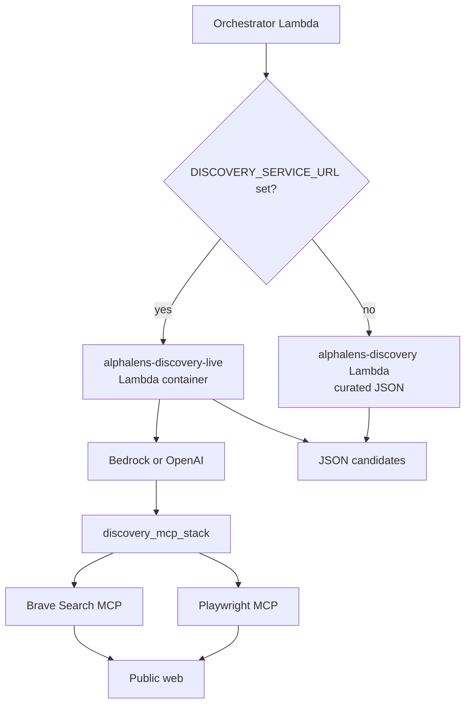

# AlphaLens — Live Discovery (Guide 4)

Guide 3 deploys **Discovery as a slim Lambda** with curated NVIDIA ecosystem JSON. This guide enables **live web research** using Bedrock Nova Pro + MCP (Playwright + Brave Search) — the same role Alex's Researcher plays in [Guide 4](../../guides/4_researcher.md).

## REMINDER — Get help from an AI assistant

> I am building AlphaLens in the alex repo under `alphalens/`. Read `alphalens/guides/4_discovery.md` completely. I'm on Guide 4 (live discovery). Help me with [your issue].

## When to use this guide

| Scenario | What to do |
|----------|------------|
| Demo / MVP / course Week 3 | **Skip this guide** — Guide 3 curated JSON is enough |
| Experiment with live research locally | Steps 1–5 below |
| Live discovery on AWS (full pipeline) | Step 6 — Lambda container + Function URL |

## What you're building

Three discovery modes coexist:

| Mode | Where it runs | When |
|------|---------------|------|
| **Curated** (MVP) | `alphalens-discovery` slim Lambda | Default when `DISCOVERY_SERVICE_URL` is unset |
| **Live MCP (local)** | Your laptop (`uv run` or local uvicorn) | `USE_LIVE_DISCOVERY=true` + MCP env flags |
| **Live MCP (AWS)** | `alphalens-discovery-live` Lambda container | After Step 6; set `DISCOVERY_SERVICE_URL` |

The **slim** `alphalens-discovery` Lambda stays on curated JSON (~20 MB). Live LLM + MCP runs in a **separate container Lambda** (`terraform/3_discovery`), same pattern as Alex Researcher.

## Architecture



## Prerequisites

Before starting:

- Completed **Guide 3** (agents deployed or API running locally)
- **Bedrock Nova Pro** enabled in `us-west-2` (see Step 1)
- **Node.js** installed (`npx` on PATH) — required for MCP subprocesses
- **Brave Search API key** (recommended) — [brave.com/search/api](https://brave.com/search/api/)
- Optional: completed **Guide 2** (Aurora) if testing full pipeline with live discovery locally

## How the code works

### `backend/discovery/agent.py`

| Function | Purpose |
|----------|---------|
| `run(payload)` | Entry point — curated JSON unless `USE_LIVE_DISCOVERY=true` |
| `create_agent(...)` | Validates MCP config; returns `(model, tools, task)` |
| `run_llm(payload)` | Async Bedrock + MCP; parses JSON candidates |
| `_parse_discovery_response()` | Extracts JSON from agent output |

When live discovery fails, `run()` **falls back** to curated NVIDIA JSON with a warning in the response.

### `backend/shared/alphalens_shared/mcp_servers.py`

| Function | Purpose |
|----------|---------|
| `create_playwright_mcp_server()` | Browser MCP via `npx @playwright/mcp` (local) or `playwright-mcp` (Docker) |
| `create_brave_search_mcp_server()` | Search MCP when `BRAVE_API_KEY` is set |
| `discovery_mcp_stack()` | Async context manager — starts all configured MCP servers |
| `discovery_mcp_enabled()` | Checks `npx` / `playwright-mcp` availability |

### `backend/discovery/templates.py`

- `DISCOVERY_INSTRUCTIONS` — agent system prompt
- `create_discovery_task(...)` — task + required JSON output shape

### Alex pattern comparison

| Alex Researcher | AlphaLens Discovery |
|-----------------|---------------------|
| `server.py` + Lambda container | `server.py` + `agent.py` (local uvicorn or Lambda container) |
| Playwright MCP | Playwright + Brave Search MCP |
| Free-form report | Structured JSON candidates |
| `create_playwright_mcp_server()` | `discovery_mcp_stack()` in shared module |

## Step 1: Enable an LLM provider

### Option A: Bedrock (course default)

1. AWS Console → **Amazon Bedrock** → region **us-west-2**
2. **Model access** → enable **Amazon Nova Pro**
3. Add to `alphalens/.env`:

```bash
LLM_PROVIDER=bedrock
BEDROCK_MODEL_ID=us.amazon.nova-pro-v1:0
BEDROCK_REGION=us-west-2
```

Verify:

```bash
aws bedrock list-foundation-models --region us-west-2 \
  --query "modelSummaries[?contains(modelId,'nova-pro')].modelId" --output table
```

### Option B: OpenAI API (when Bedrock quota is exhausted)

MCP discovery works the same. Billing is on your OpenAI account.

```bash
LLM_PROVIDER=openai
OPENAI_API_KEY=sk-...
OPENAI_MODEL_ID=gpt-4.1-mini
```

Get a key from [platform.openai.com](https://platform.openai.com/).

## Step 2: Install LLM dependencies

```bash
cd alphalens/backend/discovery
uv sync --group llm
```

This installs `openai-agents`, `litellm`, and `mcp`. These are **not** bundled in the Guide 3 Lambda package.

Verify Node.js for MCP:

```bash
npx --version
```

## Step 3: Configure environment

Add to `alphalens/.env`:

```bash
# Live discovery (Guide 4)
USE_LIVE_DISCOVERY=true
DISCOVERY_MCP_CONFIGURED=true
DISCOVERY_PLAYWRIGHT_MCP=true
BRAVE_API_KEY=your-brave-api-key

# LLM — pick one provider
LLM_PROVIDER=bedrock          # or openai
BEDROCK_MODEL_ID=us.amazon.nova-pro-v1:0
BEDROCK_REGION=us-west-2
# OPENAI_API_KEY=sk-...       # when LLM_PROVIDER=openai
# OPENAI_MODEL_ID=gpt-4.1-mini

# Optional tuning
DISCOVERY_MCP_TIMEOUT=120
DISCOVERY_MAX_TURNS=15
MCP_LOGGING=false          # set true to log MCP tool calls

# Bedrock (from Step 1, if LLM_PROVIDER=bedrock)
BEDROCK_MODEL_ID=us.amazon.nova-pro-v1:0
BEDROCK_REGION=us-west-2
```

| Variable | Default | Meaning |
|----------|---------|---------|
| `LLM_PROVIDER` | `bedrock` | `bedrock` or `openai` — selects model backend |
| `OPENAI_API_KEY` | — | Required when `LLM_PROVIDER=openai` |
| `OPENAI_MODEL_ID` | `gpt-4.1-mini` | OpenAI model when using OpenAI provider |
| `USE_LIVE_DISCOVERY` | `false` | `run()` calls `run_llm()` when `true` |
| `DISCOVERY_MCP_CONFIGURED` | `false` | Must be `true` for live mode |
| `DISCOVERY_PLAYWRIGHT_MCP` | `true` | Start Playwright browser MCP |
| `BRAVE_API_KEY` | — | Enables Brave Search MCP (recommended) |
| `DISCOVERY_MCP_TIMEOUT` | `120` | MCP session timeout (seconds) |
| `DISCOVERY_MAX_TURNS` | `15` | Max Bedrock agent turns |
| `MCP_LOGGING` | `false` | Log MCP stderr and tool events |
| `PLAYWRIGHT_MCP_COMMAND` | — | Override MCP command (Docker/Lambda container) |

**Keep `USE_LIVE_DISCOVERY=false` on the deployed Lambda** — it continues serving curated JSON without redeploy.

## Step 4: Test live discovery locally

**Directory:** `alphalens/backend/discovery`

Load env and run (takes **3–10 minutes** — Bedrock + browsing):

```bash
set -a && source ../../.env && set +a

uv run python -c "
from agent import run
import json
result = run({
    'coreCompany': 'NVIDIA',
    'coreTicker': 'NVDA',
    'scope': 'level-1',
})
print(json.dumps(result, indent=2))
"
```

**Expected:** `success: true`, `candidates` array with tickers, `warnings` may note data quality.

**Curated mode** (no Bedrock/MCP — fast):

```bash
USE_LIVE_DISCOVERY=false uv run test_simple.py
```

## Step 5: Test via local API

With the API running (`MOCK_LAMBDAS=true`), live discovery runs in-process when env flags are set:

```bash
cd alphalens/backend/api
set -a && source ../../.env && set +a
MOCK_LAMBDAS=true uv run main.py
```

In another terminal:

```bash
curl -s -X POST http://localhost:8000/api/ecosystem/discover \
  -H "Content-Type: application/json" \
  -d '{"coreCompany":"NVIDIA","coreTicker":"NVDA","scope":"level-1"}' | jq .
```

With `USE_LIVE_DISCOVERY=true` (and no `DISCOVERY_SERVICE_URL`), discovery runs in-process when you call the discovery agent directly. For API/pipeline routing, set `DISCOVERY_SERVICE_URL` to a running service (local uvicorn or AWS — see Step 6).

**Full pipeline** with live discovery (local API):

```bash
# 1. Start local discovery server
cd alphalens/backend/discovery
USE_LIVE_DISCOVERY=true DISCOVERY_MCP_CONFIGURED=true uv run uvicorn server:app --port 8001

# 2. In alphalens/.env set:
# DISCOVERY_SERVICE_URL=http://localhost:8001

# 3. Discover candidates (or skip if you already have tickers)
curl -s -X POST http://localhost:8000/api/ecosystem/discover \
  -H "Content-Type: application/json" \
  -d '{"coreCompany":"NVIDIA","coreTicker":"NVDA","scope":"level-1"}' | jq .

# 4. Portfolio analyze — candidatePool is required on this endpoint
curl -s -X POST http://localhost:8000/api/portfolio/analyze \
  -H "Content-Type: application/json" \
  -d '{
    "riskProfile": "balanced",
    "portfolio": [{"ticker":"NVDA","weight":40},{"ticker":"CASH","weight":60}],
    "candidatePool": [
      {"ticker":"TSM","relationshipType":"supplier"},
      {"ticker":"MSFT","relationshipType":"partner"}
    ]
  }' | jq .
```

Use tickers from step 3 in `candidatePool`, or map discovery `candidates[].ticker` + `relationshipType`.

## Step 6: Deploy live discovery to AWS

Deploy a **Lambda container** with Playwright MCP baked in (Alex Researcher pattern). Requires **Docker Desktop** running.

### 6.1 Configure Terraform secrets

```bash
cd alphalens/terraform/3_discovery
cp terraform.tfvars.example terraform.tfvars
```

Edit `terraform.tfvars` (Terraform HCL — not `.env` format; see comments in `terraform.tfvars.example`):

- `llm_provider` — `openai` if Bedrock daily quota is exhausted; `bedrock` otherwise
- `openai_api_key` / `brave_api_key` — paste real keys from `alphalens/.env` (not `sk-...` placeholders)
- `bedrock_region` / `bedrock_model_id` — when using Bedrock

```bash
terraform init -upgrade   # AWS provider >= 6.28 required for Lambda Function URL permissions
```

### 6.2 Build, push, and deploy

```bash
cd alphalens/backend/discovery
uv run deploy.py
```

This script:

1. Creates ECR repo `alphalens-discovery-live`
2. Builds `linux/amd64` image from `backend/discovery/Dockerfile`
3. Pushes to ECR and applies `terraform/3_discovery`
4. Prints the **Function URL** (e.g. `https://….lambda-url.us-east-1.on.aws`)

### 6.3 Wire orchestrator to live discovery

Add to `alphalens/.env` (local API and `test_full.py` / `test_service.py`):

```bash
DISCOVERY_SERVICE_URL=https://YOUR-FUNCTION-URL.lambda-url.us-east-1.on.aws
```

Re-apply Guide 3 agents so the **orchestrator Lambda** gets the URL:

```bash
cd alphalens/terraform/2_agents
# Add to terraform.tfvars:
# discovery_service_url = "https://YOUR-FUNCTION-URL.lambda-url.us-east-1.on.aws"
terraform apply
```

Or update `DISCOVERY_SERVICE_URL` on `alphalens-orchestrator` in the AWS Lambda console.

**LLM provider on zip Lambdas** (orchestrator, portfolio, qa) is separate: set `llm_provider`, `openai_api_key`, and `openai_model_id` in `terraform/2_agents/terraform.tfvars` — see [3_agents.md](./3_agents.md) Step 5. The discovery container reads LLM settings from `terraform/3_discovery/terraform.tfvars`.

### 6.4 Test deployed service

```bash
cd alphalens/backend/discovery
uv run test_service.py
```

Or run the full agent suite (discovery step uses live when URL is in `.env`):

```bash
cd alphalens/backend
uv run test_full.py
```

`discovery/test_full.py` routes like the orchestrator: **`DISCOVERY_SERVICE_URL` set** → HTTP to `alphalens-discovery-live`; **unset** → slim `alphalens-discovery` Lambda (curated JSON).

CloudWatch logs: `/aws/lambda/alphalens-discovery-live`

See [../../guides/4_researcher.md](../../guides/4_researcher.md) for the same container pattern in Alex.

## Step 7: Persist discovery runs to Aurora

Live (and orchestrated) discovery can save results to Aurora when a **Clerk user id** is present and Aurora env vars are configured.

### Tables

| Table | Contents |
|-------|----------|
| `discovery_runs` | Status, core company/ticker, scope, warnings, full JSON payload |
| `candidates` | One row per discovered company (ticker, relationship, confidence, evidence URL) |

Schema and models: `backend/database/migrations/001_schema.sql`, `backend/database/src/models.py`.

### When persistence runs

| Path | Behavior |
|------|----------|
| `POST /api/ecosystem/discover` | API passes `clerkUserId` from auth; saves after discovery |
| `alphalens-discovery-live` container | `agent.run()` / `run_llm()` call `maybe_persist_discovery()` when request includes `clerkUserId` |
| Orchestrator pipeline | Injects `clerkUserId` from the analysis job; links `analysis_jobs.discovery_run_id` |
| Slim `alphalens-discovery` zip | No database package — persistence is a no-op on that Lambda; orchestrator/API can still persist if they have Aurora env |

Persistence is skipped when:

- No `clerkUserId` in the request (anonymous / test calls)
- `PERSIST_DISCOVERY_RUNS=false`
- `AURORA_CLUSTER_ARN` / `AURORA_SECRET_ARN` not set

Successful runs return `discoveryRunId` in the JSON response.

### 7.1 Configure Terraform (live discovery Lambda)

Add Aurora outputs from Guide 2 to `terraform/3_discovery/terraform.tfvars` (same ARNs as `terraform/2_agents`):

```hcl
aurora_cluster_arn     = "arn:aws:rds:us-east-1:YOUR_ACCOUNT:cluster:alphalens-aurora-cluster"
aurora_secret_arn      = "arn:aws:secretsmanager:us-east-1:YOUR_ACCOUNT:secret:alphalens-aurora-credentials-xxxxx"
database_name          = "alphalens"
persist_discovery_runs = "true"
```

Re-deploy the container so the Lambda gets env vars and RDS Data API IAM:

```bash
cd alphalens/backend/discovery
uv run deploy.py
```

### 7.2 Verify in the database

After an authenticated discover call (or a full orchestrator job with a real Clerk user):

```bash
cd alphalens/backend/database
uv run verify_database.py
```

Or query directly:

```sql
SELECT id, core_ticker, status, created_at FROM discovery_runs ORDER BY created_at DESC LIMIT 5;
SELECT discovery_run_id, ticker, company_name FROM candidates ORDER BY created_at DESC LIMIT 10;
```

### 7.3 Local tests

```bash
cd alphalens/backend/shared
uv run pytest alphalens_shared/services/test_analyst_report.py -v   # guardrail pattern (similar)

cd alphalens/backend/database
# integration: verify discovery_runs after authenticated discover
uv run verify_database.py
```

Implementation: `backend/database/src/discovery_persist.py`, wired via `alphalens_shared/services/discovery_persist.py`.

## Fallback behavior

| Condition | Result |
|-----------|--------|
| `USE_LIVE_DISCOVERY=false` | Curated `curated_nvidia_ecosystem.json` |
| Live discovery throws | Curated JSON + warning in response |
| Non-NVDA ticker, curated mode | Empty candidates + warning |
| JSON parse fails | Empty candidates + parse warning |

Curated data path: `backend/shared/data/curated_nvidia_ecosystem.json`

## Troubleshooting

| Symptom | Likely cause | Fix |
|---------|--------------|-----|
| `NotImplementedError` — MCP not configured | Flags not set | `DISCOVERY_MCP_CONFIGURED=true` + `USE_LIVE_DISCOVERY=true` |
| `NotImplementedError` — no MCP runtime | Node.js missing | Install Node.js; verify `npx --version` |
| `ImportError` — openai-agents (local) | LLM deps not installed | `cd backend/discovery && uv sync --group llm` |
| `ImportError` — openai-agents (orchestrator/portfolio/qa on AWS) | Slim zip with `USE_LLM_*=true` | Repackage with `backend/<agent>/package_docker.py` — [3_agents.md](./3_agents.md) Step 4.3 |
| Bedrock access denied | Model not enabled | Bedrock console → Model access (us-west-2) |
| `429 Too Many Requests` / `Too many tokens per day` | Nova Pro **daily quota** exhausted | Set `LLM_PROVIDER=openai` + `OPENAI_API_KEY` for local dev; or wait ~24h; or `USE_LIVE_DISCOVERY=false`; lower `DISCOVERY_MAX_TURNS` |
| `OPENAI_API_KEY is not set, skipping trace` | Harmless — Agents SDK tracing | Ignore, or set `OPENAI_API_KEY` if using Langfuse/traces |
| MCP subprocess fails | Playwright/browser | Set `MCP_LOGGING=true`; try `DISCOVERY_PLAYWRIGHT_MCP=false` with only Brave |
| Empty candidates | Parse failure or weak search | Check `MCP_LOGGING`; verify `BRAVE_API_KEY`; retry |
| Slow / timeout | Normal for live research | Increase `DISCOVERY_MCP_TIMEOUT`; reduce `DISCOVERY_MAX_TURNS` |
| Orchestrator still returns curated only | `DISCOVERY_SERVICE_URL` not set on orchestrator | Re-apply `terraform/2_agents` or update Lambda env |
| `alphalens-discovery` Lambda curated only | Expected | Slim Lambda is curated; live runs on `alphalens-discovery-live` |
| Docker build: `Distribution not found at: file:///app/metrics` | `alphalens-shared` depends on metrics | Ensure latest `discovery/Dockerfile` copies `metrics/` into the image |
| `invoked_via_function_url` Terraform error | AWS provider too old | `terraform init -upgrade` in `terraform/3_discovery` (provider >= 6.28) |
| `/api/portfolio/analyze` — `candidatePool` required | API contract | Discover first via `/api/ecosystem/discover`, then pass tickers in `candidatePool` |
| Accidentally bundled LLM in Lambda zip | Re-packaged with wrong deps | `uv run package_agent_docker.py discovery` (slim, no LLM) |
| No `discoveryRunId` in response | Missing Clerk user or Aurora on discovery Lambda | Pass `clerkUserId`; set `aurora_*` in `terraform/3_discovery` and re-run `deploy.py` |
| Duplicate rows on discover | API + container both persist | Expected once per path; live container persists in `agent.py`; API only persists if `discoveryRunId` absent |

## Cost notes

Live discovery uses:

- **Bedrock** — Nova Pro tokens per run
- **Brave Search API** — per query (free tier available)
- **Lambda container** — ~$0 when idle; per-invocation compute when discovery runs (destroy `terraform/3_discovery` when not in use)

Destroy live discovery when not in use:

```bash
cd alphalens/terraform/3_discovery && terraform destroy
```

## What's different from Guide 3?

| Guide 3 | Guide 4 |
|---------|---------|
| Curated NVIDIA JSON | Live web research |
| Slim Lambda `alphalens-discovery` (~20 MB) | Container Lambda `alphalens-discovery-live` |
| No Bedrock required for slim path | Bedrock or OpenAI + Brave API on container |
| `test_full.py` without URL → slim Lambda | `test_service.py` or `test_full.py` with `DISCOVERY_SERVICE_URL` → live |
| Slim Lambda unchanged | `discovery_service_url` on orchestrator (terraform/2_agents) |
| No Aurora persistence | Guide 4 Step 7 — `aurora_*` on `terraform/3_discovery` |
| Analyst scores from LLM | Not applicable — analyst narrative is separate ([3_agents.md](./3_agents.md) §2.3) |
| UI: “LLM narrative unavailable” after analyze | Analyst zip missing `openai/` | Repackage analyst per [3_agents.md](./3_agents.md) §4.2; `terraform apply` in `2_agents` |

## Next steps

- [5_frontend.md](./5_frontend.md) — deploy UI + API Gateway
- [3_agents.md](./3_agents.md) — agent orchestra reference
- [agent_architecture.md](./agent_architecture.md) — `create_agent()` pattern

Or stay on Guide 3 curated demo if live discovery is not needed.
