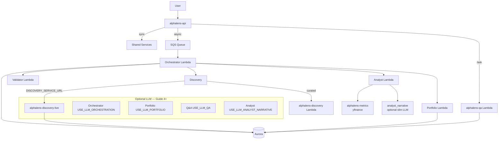

# AlphaLens Agent Architecture

Multi-agent collaboration for ecosystem discovery, opportunity analysis, and portfolio-aware recommendations.

## Agent diagram



## Design principles

1. **Metrics are deterministic** — analyst ranking uses `alphalens_metrics` + yfinance; validator uses rules
2. **Discovery ≠ recommendation** — discovery produces a candidate universe only
3. **Scores never from LLM** — `opportunityScore` and rank order come from code; optional LLM only writes `analysisReport` text (with guardrails)
4. **Structured JSON** — portfolio LLM output matches design-doc §14 API contract
5. **Two packaging strategies** — slim zips (MVP + analyst narrative) vs Alex-style LLM zips (orchestrator, portfolio, qa); live discovery uses a **container** Lambda
6. **Persistence** — discovery runs and candidates saved to Aurora when `clerkUserId` + Aurora env are set (Guide 4 Step 7)

## Agent roles

| Agent | MVP (Guide 3) | LLM path (Guide 4+) | Deployed |
|-------|-----------------|---------------------|----------|
| **Orchestrator** | Fixed pipeline via SQS; invokes other Lambdas | `USE_LLM_ORCHESTRATION` — planner with Lambda invoke tools | Zip `alphalens-orchestrator` |
| **Discovery** | Curated JSON via slim Lambda | Live MCP via `DISCOVERY_SERVICE_URL` → `alphalens-discovery-live` | Slim zip + optional container |
| **Validator** | Regex + curated list + yfinance lookup; deterministic `validationReport` | `USE_LLM_VALIDATOR_NARRATIVE` — slim OpenAI/Bedrock notes only (status stays deterministic) | Zip `alphalens-validator` |
| **Analyst** | yfinance ranking + deterministic `analysisReport` | `USE_LLM_ANALYST_NARRATIVE` — slim OpenAI/Bedrock narrative (no litellm in zip) | Zip `alphalens-analyst` |
| **Portfolio** | Risk engine + action plan (equity Add/Trim + **CASH** funding rows); deterministic `portfolioReport` | `USE_LLM_PORTFOLIO_NARRATIVE` — slim OpenAI/Bedrock notes only (actions stay deterministic) | Zip `alphalens-portfolio` |
| **Q&A** | Keyword answers from job payload | `USE_LLM_QA` — LLM with job context in task | Zip `alphalens-qa` |

## LLM configuration

| Setting | Local (`.env`) | AWS zip Lambdas | AWS discovery-live |
|---------|----------------|-----------------|------------------|
| `LLM_PROVIDER` | ✅ | `terraform/2_agents` → `llm_provider` | `terraform/3_discovery` → `llm_provider` |
| `OPENAI_API_KEY` | ✅ | `terraform/2_agents` → `openai_api_key` | `terraform/3_discovery` → `openai_api_key` |
| `USE_LLM_ORCHESTRATION` / `USE_LLM_PORTFOLIO` / `USE_LLM_QA` | ✅ | `terraform/2_agents` → `use_llm_*` | N/A |
| `USE_LLM_ANALYST_NARRATIVE` | ✅ (local API mock only) | `terraform/2_agents` → `use_llm_analyst_narrative` on **analyst** Lambda | N/A |
| `MOCK_QA` | ✅ | N/A (local API only) | N/A |
| `DISCOVERY_SERVICE_URL` | ✅ | `terraform/2_agents` → `discovery_service_url` on orchestrator | Function URL output |
| `PERSIST_DISCOVERY_RUNS` | ✅ | `terraform/3_discovery` on discovery-live | Aurora IAM + env |

Helper modules:

- `alphalens_shared/bedrock_agent.py` — `get_litellm_model()`, `run_bedrock_agent()` (orchestrator, portfolio, qa)
- `alphalens_shared/services/analyst_narrative.py` — slim narrative (OpenAI client or Bedrock Converse)
- `alphalens_shared/services/analyst_report.py` — guardrails + deterministic report fallback
- `alphalens_shared/services/discovery_persist.py` — `discovery_runs` + `candidates` writes

## Code layout (Alex-compatible)

Each deployable agent follows the same three-file pattern as Alex:

| File | Purpose |
|------|---------|
| `agent.py` | `create_agent()` for LLM agents; `run(payload)` for all |
| `templates.py` | `*_INSTRUCTIONS` + `create_*_task()` builders |
| `lambda_handler.py` | AWS entry point |

**Orchestrator:** import `RunContextWrapper` and `function_tool` at **module level** in `agent.py` (required for `@function_tool` on Lambda).

**Logging:** `alphalens_shared/lambda_logging.py` — `configure_test_logging()` (local `test_simple.py`) and `configure_lambda_logging()` (CloudWatch INFO for provider/model lines).

The **API** uses Mangum in `backend/api/lambda_handler.py` (see [5_frontend.md](./5_frontend.md)).

Shared logic lives in `backend/shared/alphalens_shared/services/` so the **API** and **Lambdas** share one code path.

### Agent `lambda_handler` pattern

Most agents use `alphalens_shared/lambda_response.py`:

```python
from alphalens_shared.lambda_logging import configure_lambda_logging

configure_lambda_logging()

from agent import run
from alphalens_shared.lambda_response import handle_agent_run

def lambda_handler(event, context):
    return handle_agent_run("alphalens-portfolio", event, context, run)
```

- Parses dict or JSON string events
- Returns `{statusCode, body}` with NaN-safe JSON
- **400** when `success: false`; **500** on uncaught exceptions
- Orchestrator is SQS-specific (wraps `process_job()` per record)

### `create_agent()` return shapes

| Agent | Returns | Alex analogue |
|-------|---------|---------------|
| orchestrator | `(model, tools, task, context)` | **planner** — tools invoke other Lambdas |
| discovery | `(model, tools, task)` | **researcher** — MCP in `run_llm()` |
| portfolio | `(model, task, output_type)` | **charter/tagger** — structured output, no tools |
| qa | `(model, task)` | **reporter** — context in task |
| analyst | Raises `NotImplementedError` | **Reporter-style narrative** via `analyst_narrative` (no `create_agent`) |
| validator | Raises `NotImplementedError` | Deterministic only |

### Packaging

| Agents | Command | LLM bundled? |
|--------|---------|--------------|
| validator, discovery (slim) | `scripts/package_agent_docker.py <name>` | No |
| analyst (rankings + narrative) | `backend/analyst/package_docker.py` | `openai` client only (~80 MB zip; **not** litellm) |
| orchestrator, portfolio, qa (LLM on AWS) | `backend/<agent>/package_docker.py` | Yes — openai-agents + litellm |
| live discovery | `backend/discovery/deploy.py` | Yes (container) |

**Do not** bundle litellm + yfinance in the analyst zip — exceeds Lambda’s 250 MB unzipped limit.

## Orchestration flow

**Deterministic (MVP):**

```text
analysis_jobs (pending)
  → SQS { jobId }
  → orchestrator → pipeline.py
      → discovery   (curated or live HTTP; optional persist to discovery_runs)
      → validator
      → analyst     (yfinance rankings + analysisReport; narrative on Lambda if USE_LLM_ANALYST_NARRATIVE)
      → portfolio
  → analysis_jobs (completed; ranked_payload may include analysisReport)

Follow-up: POST /api/jobs/{id}/ask/stream (SSE) → alphalens-api proxies to **alphalens-qa** Function URL `/ask/stream` (LLM when `USE_LLM_QA=true` on qa Lambda); MOCK_QA=true for offline keyword answers
```

**Narrative placement:** `maybe_enrich_analyst_narrative()` runs on **`alphalens-analyst`** when deployed. The API/pipeline only calls it in-process when `MOCK_LAMBDAS=true` (avoids double-enrich and missing `openai` in the API package).

**LLM orchestrator:** same steps via Bedrock tool calls (`USE_LLM_ORCHESTRATION=true`). Returns the same payload shape as `run_analysis_pipeline` (validationReport, analysisReport, warnings, rankedPayload) so async jobs and the job page work identically. Pipeline is **sequential** (each step needs the previous output) — unlike Alex planner, which can run reporter/charter/retirement in parallel.

Sync path: `POST /api/portfolio/analyze` uses the same pipeline — Lambdas when `MOCK_LAMBDAS=false`, in-process when `true`. Optional `USE_LOCAL_PORTFOLIO=true` runs only the portfolio step in-process (`invoke_portfolio()` in `lambda_invoke.py`) while other agents stay on AWS.

**Portfolio cash actions:** `ActionPlanService` emits **Trim CASH** to fund Add recommendations when cash is available; **High** cash with no adds trims toward the profile band; **Low** cash suggests raising the buffer. See [3_agents.md](./3_agents.md) §2.4.

## Database writes (who persists what)

| Component | Tables written |
|-----------|----------------|
| API `/api/ecosystem/discover` | `users`, `discovery_runs`, `candidates` |
| `alphalens-discovery-live` | same (when `clerkUserId` + Aurora on container) |
| Orchestrator `pipeline_job.py` | `analysis_jobs` (status, `discovery_run_id`, `ranked_payload`, `recommendation_payload`) |
| Analyst / portfolio / validator | No direct DB writes |

## Key files

| Component | Location |
|-----------|----------|
| Pipeline | `shared/alphalens_shared/services/pipeline.py` |
| Analyst narrative | `shared/alphalens_shared/services/analyst_narrative.py` |
| Analyst guardrails | `shared/alphalens_shared/services/analyst_report.py` |
| Discovery persistence | `shared/alphalens_shared/services/discovery_persist.py` |
| Q&A service | `shared/alphalens_shared/services/qa.py` |
| Lambda invoke + mock routing | `shared/alphalens_shared/lambda_invoke.py` |
| Agent handler responses | `shared/alphalens_shared/lambda_response.py` |
| Lambda / test logging | `shared/alphalens_shared/lambda_logging.py` |
| JSON safe for AWS (no NaN) | `shared/alphalens_shared/json_utils.py` |
| LLM helpers (full SDK) | `shared/alphalens_shared/bedrock_agent.py` |
| Metrics (yfinance in analyst dep) | `metrics/alphalens_metrics/` — `ActionPlanService`, `PortfolioRiskEngine`, `OpportunityRankingService` |
| Curated demo data | `shared/data/curated_nvidia_ecosystem.json` |
| Slim packaging | `backend/scripts/package_agent_docker.py` |
| Analyst / LLM packaging | `backend/analyst/package_docker.py`, `backend/{orchestrator,portfolio,qa}/package_docker.py` |
| Deploy script | `backend/deploy_all_lambdas.py` |
| API (local + Lambda) | `backend/api/main.py`, `backend/api/lambda_handler.py`, `discovery_stream.py`, `pipeline_stream.py`, `rank_stream.py`, `qa_stream.py` |
| Validator report copy | `shared/alphalens_shared/services/validator_report.py` — `build_validation_executive_summary()` |

## Testing

```bash
# All agents locally (MOCK_LAMBDAS=true) — shows LLM provider logs in terminal
cd alphalens/backend && uv run test_simple.py

# All agents on AWS
cd alphalens/backend && uv run test_full.py
# discovery step: live if DISCOVERY_SERVICE_URL in .env, else slim Lambda

# Analyst on AWS (rankings + optional narrative)
cd alphalens/backend/analyst && uv run test_full.py

# Live discovery only
cd alphalens/backend/discovery && uv run test_service.py

# SQS end-to-end
cd alphalens/backend/orchestrator && uv run test_full.py

# Q&A (needs completed job)
cd alphalens/backend/qa && uv run test_full.py

# Narrative guardrails (unit tests, no LLM)
cd alphalens/backend/shared && uv run pytest alphalens_shared/services/test_analyst_report.py -v

# CloudWatch LLM logs (not shown in test_full.py output)
aws logs tail /aws/lambda/alphalens-analyst --follow
aws logs tail /aws/lambda/alphalens-orchestrator --follow
```

## Guide map

- **Guide 3** — Deploy MVP Lambdas: [3_agents.md](./3_agents.md)
- **Guide 4** — Live discovery + Aurora persistence: [4_discovery.md](./4_discovery.md)
- **Guide 5** — API Lambda + frontend: [5_frontend.md](./5_frontend.md)

See also [architecture.md](./architecture.md) and [../design-doc.md](../design-doc.md).
